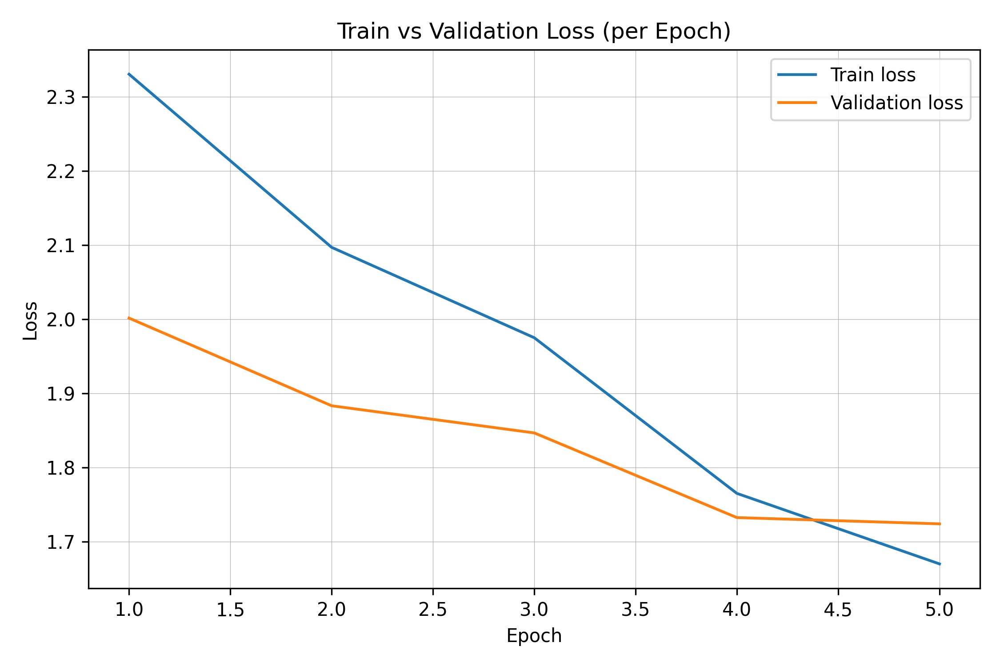

# 🖼️ Multimodal Image Captioning with BLIP

Fine-tuned **BLIP (Bootstrapping Language-Image Pre-training)** for the **Flickr8k dataset** to generate captions for unseen images.  
This project explores **vision–language models** and demonstrates a complete pipeline from **data preprocessing → training → evaluation → interactive demo**.  

---

## 📌 Overview
- Dataset: [Flickr8k](https://www.kaggle.com/datasets/adityajn105/flickr8k)
- Model: [Salesforce/blip-image-captioning-base](https://huggingface.co/Salesforce/blip-image-captioning-base)
- Frameworks: PyTorch, Hugging Face Transformers, Datasets
- Training Strategy:  
  - Parameter-efficient fine-tuning (LoRA)
  - Early stopping on validation loss
  - Beam search decoding

---

## 📂 Repository Structure
```
multimodal-image-captioning/
│
├── notebooks/                  # Kaggle pipeline notebook
│   └── imagecaptioning-final-edited.ipynb
│
├── results/                    # Training & qualitative results
│   ├── train_vs_val_loss.png   # Training vs Validation loss curve
│   └── Sample_captions/        # Example generated captions
│       ├── photo1_captioned.jpg
│       ├── photo2_captioned.jpg
│       └── photo3_captioned.jpg
│
├── requirements.txt            # Dependencies for local demo
├── README.md                   # Project documentation (this file)
└── .gitignore                  # Ignore large model files
```

---

## 🚀 Training Pipeline (Kaggle Notebook)
1. **Environment Setup** – install libraries, configure GPU (T4).
2. **Dataset Prep** – parse Flickr8k `captions.txt` + resize images (224×224).
3. **Data Collator** – augmentations for training; clean collator for eval.
4. **Model Setup** – BLIP encoder–decoder, LoRA applied to reduce memory.
5. **Training** – run with `Seq2SeqTrainer` (loss-only validation for speed).
6. **Evaluation** – compute **BLEU-1/2/3/4, ROUGE-L, METEOR** on test set.
7. **Inference** – generate captions for unseen images.

---

## 📊 Evaluation

### Test Metrics (Single vs Multi-Reference)

| Metric     | Single-ref | Multi-ref |
|------------|------------|-----------|
| test_loss  | 1.7448     | –         |
| BLEU-1     | 0.2831     | 0.5676    |
| BLEU-2     | 0.1709     | 0.4111    |
| BLEU-3     | 0.1078     | 0.2912    |
| BLEU-4     | 0.0693     | 0.2039    |
| ROUGE-L    | 0.3267     | 0.4547    |
| METEOR     | 0.3388     | 0.5123    |

✔ Multi-reference scoring (5 captions per image) shows stronger alignment with human evaluation.

---

### Training vs Validation Loss


---

## 🖼️ Sample Captions
Sample generated captions are available in the [`results/Sample_captions/`](results/Sample_captions) folder.  

---

## ⚙️ Requirements
See `requirements.txt` for full details:
- `torch`
- `transformers==4.56.0`
- `evaluate==0.4.5`
- `accelerate>=0.33.0`
- `pandas`, `matplotlib`, `nltk`, `rouge-score`
- `gradio`

---

## 🚀 How to Run

### 1️⃣ Clone & Install
```bash
git clone https://github.com/<yaekobB>/multimodal-image-captioning.git
cd multimodal-image-captioning
pip install -r requirements.txt
```


## 📌 Highlights
- **End-to-end pipeline**: from dataset preprocessing to interactive demo.
- **State-of-the-art BLIP model** fine-tuned for captioning.

---


## 📜 License
MIT License.  
You’re free to use and modify this project for research and educational purposes.

---

## ✨ Acknowledgements
- [BLIP model (Salesforce)](https://huggingface.co/Salesforce/blip-image-captioning-base)  
- [Flickr8k Dataset](https://www.kaggle.com/datasets/adityajn105/flickr8k)  
- [Kaggle](https://www.kaggle.com) for training environment  
